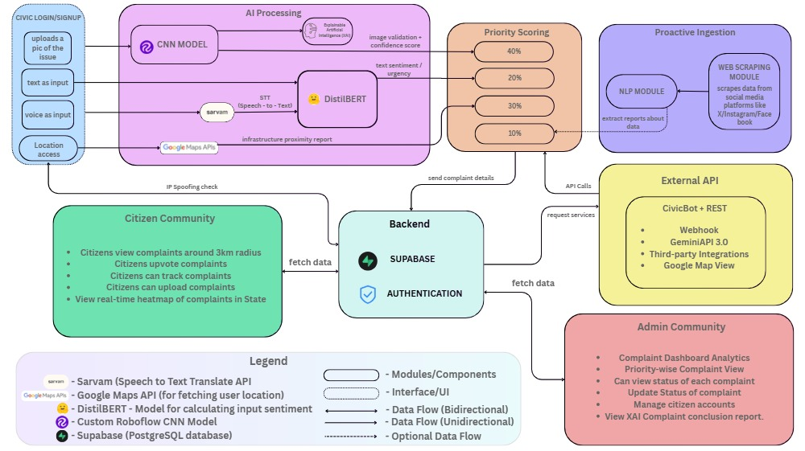
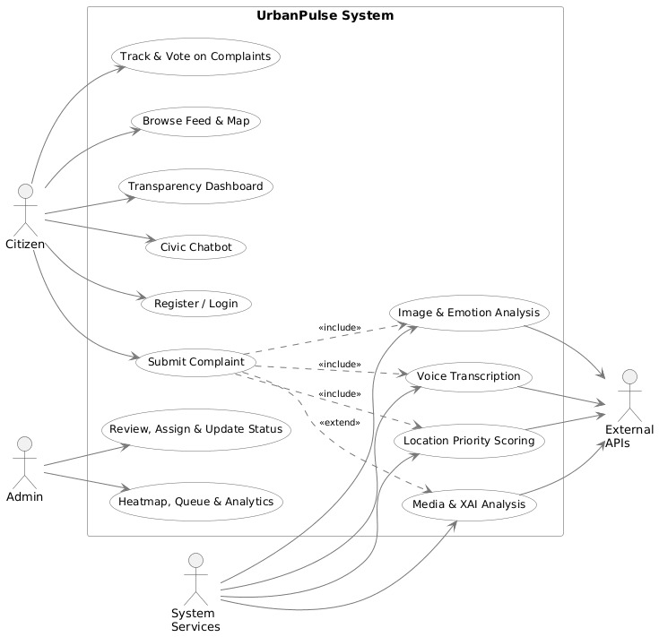
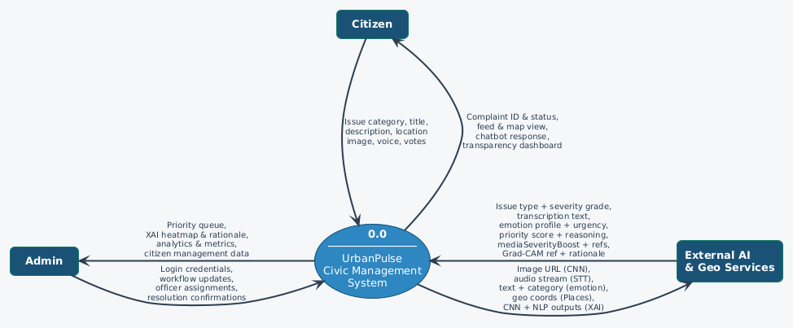
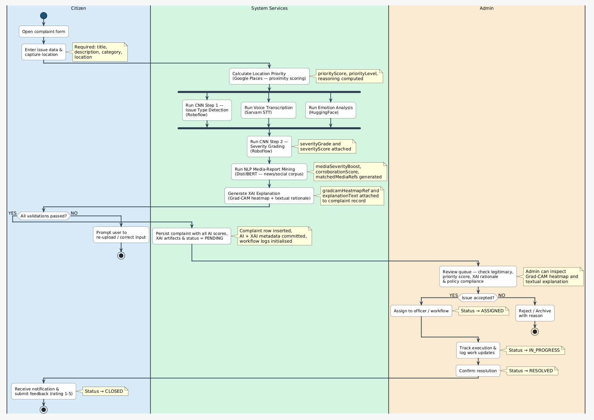
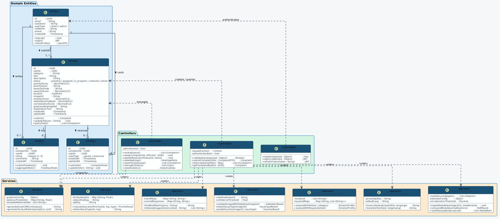

<p align="center">
  
  
  
  
</p>

# UrbanPulse Frontend

**Smart Civic Complaint Portal** -- A modern React web application that empowers citizens to report, track, and resolve civic issues through AI-powered image classification, interactive maps, real-time dashboards, and transparent governance analytics.

---

## Table of Contents

- [Overview](#overview)
- [System Architecture](#system-architecture)
- [Key Features](#key-features)
- [Tech Stack](#tech-stack)
- [Getting Started](#getting-started)
- [Environment Variables](#environment-variables)
- [Application Structure](#application-structure)
- [User Guide](#user-guide)
- [Admin Guide](#admin-guide)
- [System Design](#system-design)
- [Testing](#testing)
- [Deployment](#deployment)
- [Contributing](#contributing)
- [License](#license)

---

## Overview

UrbanPulse Frontend is the citizen-facing and admin-facing web portal for the UrbanPulse civic complaint management platform. It provides an intuitive, multi-step complaint submission wizard with AI-powered auto-detection, real-time complaint feeds with community voting, interactive heat maps, a civic chatbot, and a full admin dashboard for complaint triage and resolution workflow management.

---

## System Architecture

<p align="center">
  
</p>

The frontend is a single-page application (SPA) built with React and Vite. It communicates with the UrbanPulse Backend REST API for all data operations and integrates with Cloudinary for media uploads and Leaflet for map rendering.

### Architecture Highlights

- **Role-based routing** -- Separate citizen and admin layouts with protected routes
- **Context-based state management** -- React Context API for authentication state
- **API service layer** -- Centralized API client with automatic JWT injection
- **Responsive design** -- Mobile-first approach with Tailwind CSS

---

## Key Features

### Citizen Portal

| Feature | Description |
|---|---|
| **AI Image Upload** | Upload a photo and let the Roboflow CNN auto-detect the issue category |
| **Multi-Step Submission** | Guided 4-step wizard: Issue Type, Details, Location, Review |
| **Complaint Feed** | Browse all community complaints with upvoting support |
| **Interactive Map** | Leaflet-powered map with heat map overlay of complaint density |
| **Personal Reports** | Track the status and history of your own submissions |
| **Civic Chatbot** | AI chatbot for civic queries and platform help |
| **Transparency Dashboard** | View government resolution rates and performance metrics |
| **Feedback System** | Rate the resolution quality of completed complaints |

### Admin Portal

| Feature | Description |
|---|---|
| **Analytics Dashboard** | Real-time statistics: total complaints, resolution rates, category breakdown |
| **Priority Queue** | AI-ranked complaint list sorted by composite priority score |
| **Complaint Management** | Review, assign, and update complaint status through resolution workflow |
| **Citizen Management** | View and manage citizen accounts and complaint histories |
| **Admin Map View** | Geographic overview of all complaints for spatial analysis |
| **XAI Rationale** | Inspect Grad-CAM heatmaps and AI reasoning for each complaint |

---

## Tech Stack

| Layer | Technology |
|---|---|
| Framework | React 18.3 |
| Build Tool | Vite 6.x |
| Styling | Tailwind CSS 3.4 |
| Routing | React Router DOM 6.x |
| Maps | Leaflet + React-Leaflet + Leaflet.heat |
| Charts | Chart.js + React-Chartjs-2 |
| Animations | Framer Motion |
| Date Handling | date-fns |
| Notifications | React Hot Toast |
| Icons | React Icons (HeroIcons) |
| HTTP Client | Axios + Fetch API |
| Testing | Vitest + React Testing Library |

---

## Getting Started

### Prerequisites

- Node.js 18 or higher
- npm 9+
- UrbanPulse Backend running on port 3001

### Installation

```bash
# Clone the repository
git clone https://github.com/your-org/UrbanPulse_Frontend.git
cd UrbanPulse_Frontend/urbanpulse-web

# Install dependencies
npm install

# Configure environment
cp .env.example .env
# Edit .env with your backend URL

# Start development server
npm run dev
```

The application will be available at `http://localhost:5173` (Vite default).

### Build for Production

```bash
npm run build
npm run preview  # Preview production build locally
```

---

## Environment Variables

Create a `.env` file in the `urbanpulse-web/` directory:

| Variable | Required | Description |
|---|:---:|---|
| `VITE_API_BASE_URL` | No | Backend API URL (auto-detected from `window.location` if not set) |

The frontend automatically infers the backend URL from the current hostname:

```
Priority: VITE_API_BASE_URL > http://{current-hostname}:3001 > http://localhost:3001
```

---

## Application Structure

```
urbanpulse-web/
├── index.html                    # HTML entry point
├── package.json                  # Dependencies and scripts
├── vite.config.js                # Vite build configuration
├── tailwind.config.js            # Tailwind CSS configuration
├── postcss.config.js             # PostCSS plugins
│
├── public/                       # Static assets
│
├── src/
│   ├── main.jsx                  # React DOM entry point
│   ├── App.jsx                   # Root component with routing
│   ├── index.css                 # Global styles + Tailwind directives
│   │
│   ├── context/
│   │   └── AuthContext.jsx       # Authentication state management
│   │
│   ├── layouts/
│   │   ├── CitizenLayout.jsx     # Citizen portal shell (sidebar, nav)
│   │   └── AdminLayout.jsx       # Admin portal shell (sidebar, nav)
│   │
│   ├── pages/
│   │   ├── auth/
│   │   │   ├── Welcome.jsx       # Landing page
│   │   │   ├── Login.jsx         # Login form
│   │   │   ├── CitizenSignup.jsx # Citizen registration
│   │   │   └── AdminSignup.jsx   # Admin registration
│   │   │
│   │   ├── citizen/
│   │   │   ├── ComplaintFeed.jsx      # Community complaint feed
│   │   │   ├── CitizenDashboard.jsx   # Personal stats dashboard
│   │   │   ├── SubmitComplaint.jsx    # Multi-step submission wizard
│   │   │   ├── ComplaintMap.jsx       # Interactive heat map
│   │   │   ├── PersonalReports.jsx    # User's complaint history
│   │   │   ├── ComplaintDetail.jsx    # Single complaint detail view
│   │   │   ├── Chatbot.jsx           # AI civic chatbot
│   │   │   ├── Transparency.jsx      # Public transparency metrics
│   │   │   └── FeedbackScreen.jsx    # Resolution feedback form
│   │   │
│   │   └── admin/
│   │       ├── AdminDashboard.jsx         # Analytics overview
│   │       ├── AdminComplaints.jsx        # Complaint management list
│   │       ├── AdminComplaintDetail.jsx   # Admin complaint detail
│   │       ├── PriorityQueue.jsx          # AI priority-ranked queue
│   │       ├── AdminComplaintMap.jsx      # Admin geographic view
│   │       ├── CitizenManagement.jsx      # Citizen account list
│   │       └── CitizenDetails.jsx         # Citizen profile detail
│   │
│   └── services/
│       └── api.js                # Centralized API client & endpoints
│
└── docs/
    └── diagrams/                 # Architecture and design diagrams
```

---

## User Guide

### Citizen Workflow

#### 1. Registration and Login

Navigate to the landing page and create a citizen account. After login, you are redirected to the complaint feed.

#### 2. Submitting a Complaint

The complaint submission follows a guided 4-step wizard:

**Step 1 -- Issue Type Selection**
- **AI Auto-Detection (Recommended)**: Upload a photo and the AI will automatically classify the issue type
- **Manual Selection**: Choose from 13 predefined categories including Pothole, Streetlight, Garbage, Sewage, Water, Fire Hazard, Electrical, Traffic Signal, Road Damage, Parking, Noise, Structural Damage, and Other

**Step 2 -- Details**
- Enter a descriptive title (minimum 3 characters)
- Provide a detailed description (minimum 10 characters, maximum 1000)
- Set priority level (Low, Medium, High, Critical)

**Step 3 -- Location**
- Choose privacy level: Exact (+/-5-10m), Street-Level (+/-25m), or Neighborhood (+/-150m)
- Click "Detect My Location" for GPS auto-detection
- Or manually enter latitude, longitude, and address

**Step 4 -- Review and Submit**
- Review all entered information
- Submit the complaint

#### 3. Tracking and Community Features

- **Feed**: Browse all complaints, upvote important issues
- **Map**: See complaints plotted on an interactive heat map
- **My Reports**: Track the status of your own submissions
- **Chatbot**: Ask questions about civic procedures or platform usage
- **Transparency**: View aggregated resolution statistics

---

### Complaint Lifecycle

```
PENDING --> ASSIGNED --> IN_PROGRESS --> RESOLVED --> CLOSED
```

| Status | Description |
|---|---|
| Pending | Newly submitted, awaiting admin review |
| Assigned | Assigned to a department or officer |
| In Progress | Actively being worked on |
| Resolved | Work completed, awaiting citizen confirmation |
| Closed | Citizen has confirmed resolution and submitted feedback |

---

## Admin Guide

### Dashboard

The admin dashboard provides real-time analytics:
- Total complaints count with status breakdown
- Resolution rate percentage
- Category distribution chart
- Recent complaint activity

### Priority Queue

Complaints are ranked by a composite AI priority score:

| Weight | Factor | Source |
|:---:|---|---|
| 40% | Image Validation | Roboflow CNN confidence |
| 20% | Emotion Urgency | DistilBERT sentiment analysis |
| 30% | Location Sensitivity | Google Places infrastructure proximity |
| 10% | Community Interest | Upvote count and recency |

### Complaint Management

1. Click any complaint to view full details including AI scores
2. Update status through the resolution workflow
3. Add resolution notes for transparency
4. View the XAI rationale (Grad-CAM heatmap and explanation text)

### Citizen Management

- View all registered citizens
- Inspect individual complaint histories
- Monitor account activity

---

## System Design

### Use Case Diagram

<p align="center">
  
</p>

### Data Flow Diagram -- Level 0 (Context)

<p align="center">
  
</p>

### Data Flow Diagram -- Level 1

<p align="center">
  
</p>

### Data Flow Diagram -- Level 2 (AI Pipeline)

<p align="center">
  
</p>

### Sequence Diagram -- Complaint Submission

<p align="center">
  
</p>

### Activity Diagram -- End-to-End Workflow

<p align="center">
  
</p>

### Class Diagram

<p align="center">
  
</p>

---

## Routing Map

### Public Routes (Unauthenticated)

| Path | Component | Description |
|---|---|---|
| `/` | Welcome | Landing page |
| `/login` | Login | Authentication form |
| `/citizen/signup` | CitizenSignup | Citizen registration |
| `/admin/signup` | AdminSignup | Admin registration |

### Citizen Routes (Protected)

| Path | Component | Description |
|---|---|---|
| `/citizen/feed` | ComplaintFeed | Community complaint feed |
| `/citizen/dashboard` | CitizenDashboard | Personal statistics |
| `/citizen/submit` | SubmitComplaint | Complaint submission wizard |
| `/citizen/map` | ComplaintMap | Interactive heat map |
| `/citizen/reports` | PersonalReports | User's complaints |
| `/citizen/complaint/:id` | ComplaintDetail | Complaint detail view |
| `/citizen/chatbot` | Chatbot | AI civic chatbot |
| `/citizen/feedback` | FeedbackScreen | Resolution feedback |
| `/citizen/transparency` | Transparency | Public metrics dashboard |

### Admin Routes (Protected)

| Path | Component | Description |
|---|---|---|
| `/admin/dashboard` | AdminDashboard | Analytics overview |
| `/admin/complaints` | AdminComplaints | Complaint management |
| `/admin/complaints/:id` | AdminComplaintDetail | Complaint detail (admin) |
| `/admin/priority` | PriorityQueue | AI priority ranking |
| `/admin/map` | AdminComplaintMap | Geographic overview |
| `/admin/citizens` | CitizenManagement | Citizen accounts |
| `/admin/citizens/:id` | CitizenDetails | Citizen profile |

---

## Testing

The project uses Vitest with React Testing Library:

```bash
# Run all tests
npm run test

# Run tests in watch mode
npx vitest
```

Test files follow the `*.test.jsx` convention and are co-located with their components.

---

## Deployment

### Netlify (Recommended)

1. Push the repository to GitHub
2. Connect to [Netlify](https://netlify.com)
3. Set the base directory to `urbanpulse-web`
4. Set the build command to `npm run build`
5. Set the publish directory to `urbanpulse-web/dist`
6. Add environment variable: `VITE_API_BASE_URL=https://your-backend.onrender.com`
7. Deploy

### Vercel

```bash
cd urbanpulse-web
npx vercel --prod
```

### Docker

```dockerfile
FROM node:18-alpine AS build
WORKDIR /app
COPY package*.json ./
RUN npm ci
COPY . .
RUN npm run build

FROM nginx:alpine
COPY --from=build /app/dist /usr/share/nginx/html
EXPOSE 80
CMD ["nginx", "-g", "daemon off;"]
```

---

## Browser Support

| Browser | Version |
|---|---|
| Chrome | 90+ |
| Firefox | 90+ |
| Safari | 14+ |
| Edge | 90+ |

---

## Contributing

1. Fork the repository
2. Create a feature branch: `git checkout -b feature/your-feature`
3. Commit changes: `git commit -m "Add your feature"`
4. Push to branch: `git push origin feature/your-feature`
5. Open a Pull Request

### Code Style

- Use functional components with hooks
- Follow the existing file/folder naming conventions
- Use the centralized API client (`services/api.js`) for all backend calls
- Keep components focused and reusable

---

## License

This project is licensed under the MIT License. See the [LICENSE](LICENSE) file for details.

---

<p align="center">
  Built with purpose by <strong>Team REZO</strong>
</p>
